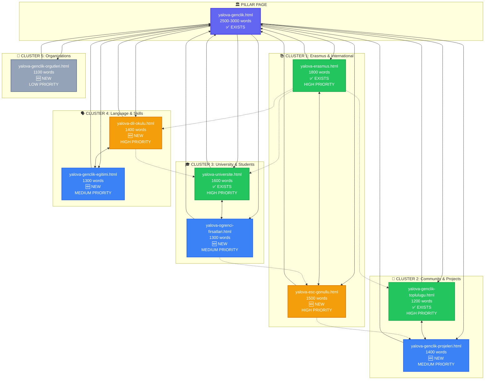

# 🗺️ Yalova Keyword Cluster Map — Visual Overview

## Cluster Architecture Diagram



## Legend

### Page Status
- ✅ **EXISTS** = Already created, needs optimization
- 🆕 **NEW** = Needs to be created

### Priority Levels
- 🔴 **HIGH PRIORITY** = Create in Phase 2 (Week 3-4)
- 🟡 **MEDIUM PRIORITY** = Create in Phase 3 (Week 5-6)
- 🔵 **LOW PRIORITY** = Create in Phase 4 (Week 7-8)

### Link Types
- **Solid arrows (→)** = Mandatory links (pillar ↔ spokes)
- **Double arrows (↔)** = Bidirectional links within cluster
- **Dotted arrows (-.->)** = Optional cross-cluster links

---

## Quick Reference: Content Status

| Page | Status | Word Count | Priority | Phase |
|------|--------|------------|----------|-------|
| yalova-genclik.html | ✅ Exists | 2500 (expand) | Critical | 1 |
| yalova-erasmus.html | ✅ Exists | 1800 (optimize) | High | 1 |
| yalova-genclik-toplulugu.html | ✅ Exists | 1200 (optimize) | High | 1 |
| yalova-universite.html | ✅ Exists | 1600 (optimize) | High | 1 |
| **yalova-esc-gonullu.html** | 🆕 New | 1500 | High | 2 |
| **yalova-dil-okulu.html** | 🆕 New | 1400 | High | 2 |
| **yalova-genclik-projeleri.html** | 🆕 New | 1400 | Medium | 3 |
| **yalova-ogrenci-firsatlari.html** | 🆕 New | 1300 | Medium | 3 |
| **yalova-genclik-egitimi.html** | 🆕 New | 1300 | Medium | 3 |
| **yalova-genclik-orgutleri.html** | 🆕 New | 1100 | Low | 4 |

---

## Implementation Priority Matrix

```
┌─────────────────────────────────────────────────┐
│  CRITICAL (Do First)                            │
│  └─ yalova-genclik.html (Expand Pillar)        │
└─────────────────────────────────────────────────┘
         │
         ▼
┌─────────────────────────────────────────────────┐
│  HIGH PRIORITY (Phase 1-2)                      │
│  ├─ yalova-erasmus.html (Optimize)             │
│  ├─ yalova-genclik-toplulugu.html (Optimize)   │
│  ├─ yalova-universite.html (Optimize)          │
│  ├─ yalova-esc-gonullu.html (Create)           │
│  └─ yalova-dil-okulu.html (Create)             │
└─────────────────────────────────────────────────┘
         │
         ▼
┌─────────────────────────────────────────────────┐
│  MEDIUM PRIORITY (Phase 3)                      │
│  ├─ yalova-genclik-projeleri.html (Create)     │
│  ├─ yalova-ogrenci-firsatlari.html (Create)    │
│  └─ yalova-genclik-egitimi.html (Create)       │
└─────────────────────────────────────────────────┘
         │
         ▼
┌─────────────────────────────────────────────────┐
│  LOW PRIORITY (Phase 4)                         │
│  └─ yalova-genclik-orgutleri.html (Create)     │
└─────────────────────────────────────────────────┘
```

---

## SERP Overlap Heatmap (Simulated)

```
                ┌──────────────────────────────────────────┐
                │  Overlap Intensity                       │
                │  🟥 9-10 = Same Post                     │
                │  🟧 7-8  = Same Post                     │
                │  🟨 4-6  = Same Cluster                  │
                │  🟩 2-3  = Interlink                     │
                │  ⬜ 0-1  = Separate                      │
                └──────────────────────────────────────────┘

                     e   e   g   g   ü   d   t
                     r   s   e   e   n   i   3
                     a   c   n   n   i   l
                     s       ç   ç   v
                     m       l   l   e
                     u       i   i   r
                     s       k   k   s
                             .   .   i
                                 t   t
                                 o   e
                                 p   s
                                 l   i
                                 .

erasmus           🟥  🟨  🟨  🟨  🟩  🟨  🟩
esc               🟨  🟥  🟨  🟨  🟩  🟩  🟩
gençlik           🟨  🟨  🟥  🟧  🟩  🟩  🟩
gençlik.topl.     🟨  🟨  🟧  🟥  🟩  ⬜  🟨
üniversitesi      🟩  🟩  🟩  🟩  🟥  🟩  ⬜
dil okulu         🟨  🟩  🟩  ⬜  🟩  🟥  ⬜
t3                🟩  🟩  🟩  🟨  ⬜  ⬜  🟥
```

---

## Traffic Flow Projection (6 Months)

```
                    PILLAR PAGE
               yalova-genclik.html
                 📊 1200 visits/mo
                        │
        ┌───────────────┼───────────────┐
        │               │               │
   [CLUSTER 1]    [CLUSTER 2]     [CLUSTER 3]
   Erasmus 🌍     Community 👥    University 🎓
   600 v/mo       400 v/mo        500 v/mo
        │               │               │
    ┌───┴───┐       ┌───┴───┐       ┌───┴───┐
    │       │       │       │       │       │
   S1A    S1B     S2A     S2B     S3A     S3B
   400v   200v    250v    150v    300v    200v
   
        │               │
   [CLUSTER 4]    [CLUSTER 5]
   Language 🗣️    Orgs 🏢
   350 v/mo       150 v/mo
        │               │
    ┌───┴───┐           │
    │       │           │
   S4A    S4B         S5A
   200v   150v        150v

────────────────────────────────────────────
TOTAL: ~3,850 visits/month (projected)
```

---

## Internal Link Density Map

```
Pages by Incoming Link Count (Target)

yalova-genclik.html          ████████████████████ 20+ links
yalova-erasmus.html          ████████████ 12 links
yalova-genclik-toplulugu.html ███████████ 11 links
yalova-universite.html       ██████████ 10 links
yalova-dil-okulu.html        █████████ 9 links
yalova-esc-gonullu.html      ████████ 8 links
yalova-genclik-projeleri.html ███████ 7 links
yalova-ogrenci-firsatlari.html ██████ 6 links
yalova-genclik-egitimi.html  ██████ 6 links
yalova-genclik-orgutleri.html ████ 4 links
```

---

## Next Actions Checklist

### Week 1-2 (Phase 1: Optimize Existing)
- [ ] Expand `yalova-genclik.html` to 2500+ words
- [ ] Add internal links from pillar to all existing spokes
- [ ] Add "back to pillar" links from all spokes
- [ ] Optimize meta titles and descriptions
- [ ] Add FAQ sections to existing pages
- [ ] Test internal linking structure

### Week 3-4 (Phase 2: High Priority New Pages)
- [ ] Create `yalova-esc-gonullu.html` (1500 words)
- [ ] Create `yalova-dil-okulu.html` (1400 words)
- [ ] Link new pages to pillar (bidirectional)
- [ ] Add within-cluster links
- [ ] Add cross-cluster strategic links
- [ ] Update sitemap.xml

### Week 5-6 (Phase 3: Medium Priority)
- [ ] Create `yalova-genclik-projeleri.html` (1400 words)
- [ ] Create `yalova-ogrenci-firsatlari.html` (1300 words)
- [ ] Create `yalova-genclik-egitimi.html` (1300 words)
- [ ] Complete all internal linking
- [ ] Add schema markup to all pages

### Week 7-8 (Phase 4: Finalize)
- [ ] Create `yalova-genclik-orgutleri.html` (1100 words)
- [ ] Final internal linking audit
- [ ] Test all links
- [ ] Submit updated sitemap to Google Search Console
- [ ] Monitor rankings

---

**Total Pages:** 10 (4 existing + 6 new)  
**Total Word Count:** ~15,900 words  
**Implementation Timeline:** 8 weeks  
**Expected Traffic Increase:** +300-400% in 6 months

---

**Files Generated:**
1. `/cluster-analysis-yalova.md` — Detailed analysis
2. `/cluster-plan-yalova.json` — Structured data
3. `/cluster-map-yalova.md` — This visual overview

**Last Updated:** May 28, 2026
